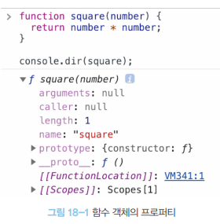

# 18장 함수와 일급 객체

## 목차

1. [일급 객체](#1-일급-객체)
2. [함수 객체의 프로퍼티](#2-함수-객체의-프로퍼티)

<br />

## 1. 일급 객체

1. 무명의 **리터럴로 생성**할 수 있다. 즉, 런타임에 생성이 가능하다.
2. **변수나 자료구조**(객체, 배열 등)에 저장할 수 있다.
3. 함수의 **매개변수에 전달**할 수 있다.
4. 함수의 **반환값으로 사용**할 수 있다.

자바스크립트 함수는 위의 조건을 모두 만족하므로 일급 객체이다.<br>
⇒ 함수를 객체와 동일하게 사용할 수 있다.

```js
// 1. 함수는 무명의 리터럴로 생성할 수 있다.
// 2. 함수는 변수에 저장할 수 있다.
// 런타임(할당 단계)에 함수 리터럴이 평가되어 함수 객체가 생성되고 변수에 할당된다.
const increase = function (num) {
  return ++num;
};

const decrease = function (num) {
  return --num;
};

// 2. 함수는 객체에 저장할 수 있다.
const auxs = { increase, decrease };

// 3. 함수의 매개변수에게 전달할 수 있다.
// 4. 함수의 반환값으로 사용할 수 있다.
function makeCounter(aux) {
  let num = 0;

  return function () {
    num = aux(num);
    return num;
  };
}

// 3. 함수는 매개변수에게 함수를 전달할 수 있다.
const increaser = makeCounter(auxs.increase);
console.log(increaser()); // 1
console.log(increaser()); // 2

// 3. 함수는 매개변수에게 함수를 전달할 수 있다.
const decreaser = makeCounter(auxs.decrease);
console.log(decreaser()); // -1
console.log(decreaser()); // -2
```

<br />

## 2. 함수 객체의 프로퍼티



함수 객체 고유의 데이터 프로퍼티 : arguments, caller, length, name, prototype,
Object.prototype 객체에게서 상속 받은 접근자 프로퍼티 : \_\_proto\_\_

<br>

### 1. arguments 프로퍼티

함수의 arguments 프로퍼티의 값은 arguments 객체이다.<br>
arguments 객체는 **함수 호출 시 전달된 인수들의 정보**를 담고 있는 순회 가능한 유사 배열 객체이며, 함수 내부에서 지역 변수처럼 사용된다. 즉, 함수 외부에서는 참조 할 수 없다.

함수 객체의 arguments 프로퍼티 : ES3부터 표준 폐지<br>
⇒ arguments 객체 참조

- arguments 객체
  - 프로퍼티 키 : 인수의 순서
  - 프로퍼티 값 : 인수
  - callee 프로퍼티 : 함수 자신
  - length 프로퍼티 : 인수의 개수
  - 가변 인자 함수를 구현할 때 유용
  - 유사 배열 객체

유사 배열 객체는 배열 메서드를 사용하기 위해서 Function.prototype.call, Function.prototype.apply를 사용해 간접 호출해야한다.<br>
⇒ Rest 파라미터 도입 (26.4절에서 더 자세히 살펴볼 예정)

> 유사 배열 객체와 이터러블
>
> 이터러블 : 이터레이터 프로토콜을 준수하면서 순회 가능한 자료구조 <br>
> 유사 배열 객체 : length 프로퍼티를 가진 객체로 for 문으로 순회할 수 있는 객체

<br>

### 2. caller 프로퍼티

ECMAScript 사양에 포함되지 않는 비표준 프로퍼티

함수 자신을 호출한 함수, 없다면 null

Node.js 환경에서는 다른 결과가 나온다. 이는 모듈과 관련이 있다. 48장에서 더 자세히 살펴볼 것이다.

<br>

### 3. length 프로퍼티

함수를 정의할 때 선언한 매개변수의 개수

arguments 객체의 length 프로퍼티 : 인자의 개수 <br>
함수 객체의 length 프로퍼티 : 매개변수의 개수

<br>

### 4. name 프로퍼티

함수 이름 (ES6 이후 정식 표준)

익명 함수 표현식 : 빈문자열(ES5), 식별자(ES6)

<br>

### 5. \_\_proto\_\_ 접근자 프로퍼티

모든 객체는 [[Prototype]]이라는 내부 슬롯을 갖는다.

[[Prototype]] 내부 슬롯은 객체 지향 프로그래밍의 상속을 구현하는 프로토타입 객체를 가리킨다. (19장 프로토타입에서 더 자세히 살펴볼 것)

[[Prototype]] 내부 슬롯에 직접 접근 할 수 없고 \_\_proto\_\_ 접근자 프로퍼티를 통해 간접적으로 프로토타입 객체에 접근할 수 있다.

>hasOwnProperty
> 
> 인수로 전달받은 프로퍼티 키가 객체 고유의 프로퍼티 키인 경우에만 true를 반환<br>
> 상속 받은 프로토타입의 프로퍼티 키인 경우 false 반환

<br>

### 6. prototype 프로퍼티

생성자 함수로 호출 할 수 있는 함수 객체, 즉 constructor만이 소유하는 프로퍼티

함수가 객체를 생성하는 생성자 함수로 호출될 때 생성자 함수가 생성할 인스턴스의 프로토타입 객체를 가리킨다.