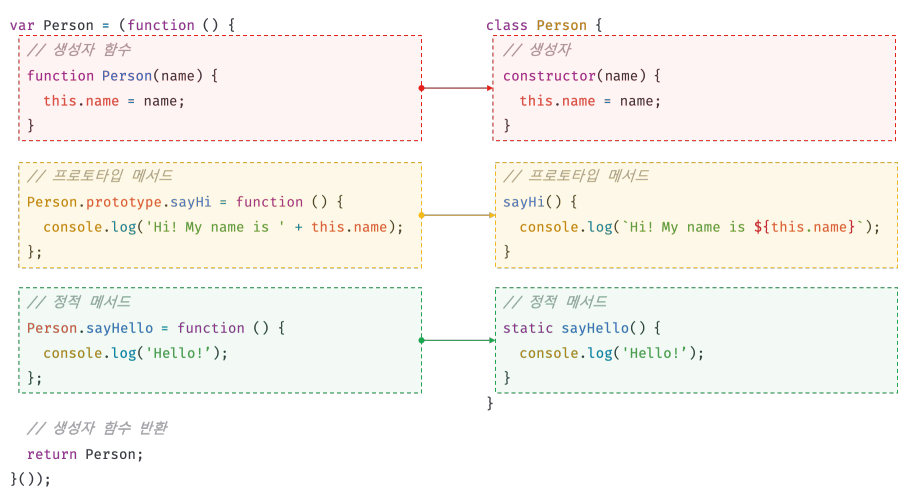
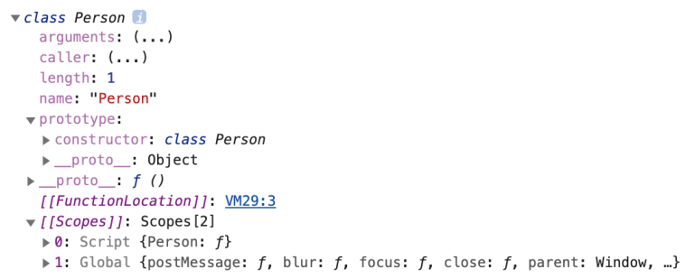
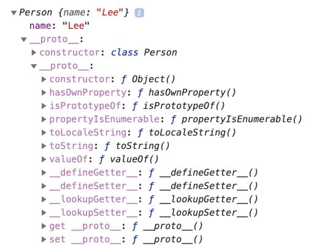
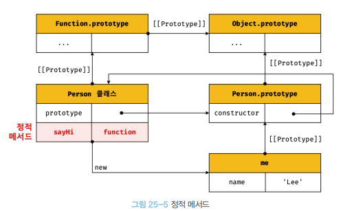

# 25장 클래스

## 목차

1. [일급 객체](#1-일급-객체)
2. [함수 객체의 프로퍼티](#2-함수-객체의-프로퍼티)

<br />

## 1. 클래스는 프로토타입의 문법적 설탕인가?

클래스와 생성자 함수는 모두 프로토타입 기반의 인스턴스를 생성하지만 정확히 동일하게 동작하지 않는다. 클래스는 생성자 함수보다 엄격하며 생성자 함수에서는 제공하지 않는 기능도 제공한다. 다음과 같이 몇 가지 차이가 있다.

- 클래스는 new 연산자 없이 호출하면 에러가 발생한다.
- 클래스는 상속을 지원하는 extends와 super 키워드를 제공한다.
- 클래스는 호이스팅이 발생하지 않는 것처럼 동작한다.
- 클래스 내의 모든 코드에는 암묵적으로 strict mode가 지정되어 실행된다.
- 클래스의 constructor, 프로토타입 메서드, 정적 메서드는 모두 프로퍼티 어트리뷰트 [[Enumerable]]의 값이 false다.

클래스를 새로운 객체 생성 메커니즘으로 보는 것이 좀 더 합당하다.

<br />

## 2. 클래스 정의

class 키워드를 사용하여 정의한다. 클래스 이름은 생성자 함수와 마찬가지로 파스칼 케이스를 사용하는 것이 일반적이다.

클래스는 함수다. 따라서 일급 객체이다.

> 일급 객체
>
> 무명의 리터럴로 생성할 수 있다. 즉, 런타임에 생성이 가능하다.<br />
> 변수나 자료구조(객체, 배열 등)에 저장할 수 있다.<br />
> 함수의 매개변수에게 전달할 수 있다.<br />
> 함수의 반환값으로 사용할 수 있다.

<br />

클래스 몸체에는 0개 이상의 메서드만 정의할 수 있다.

- constructor(생성자)
- 프로토타입 메서드
- 정적 메서드

<br>



<br>

### 3. 클래스 호이스팅

클래스는 함수로 평가된다.

클래스 선언문으로 정의한 클래스는 런타임 이전에 먼저 평가되어 함수 객체를 생성한다. 이때 클래스가 평가되어 생성된 함수 객체는 생성자 함수로서 호출할 수 있는 함수, 즉 constructor다. 생성자 함수로서 호출할 수 있는 함수는 함수 정의가 평가되어 함수 객체를 생성하는 시점에 프로토 타입도 더불어 생성된다. 프로토타입과 생성자 함수는 단독으로 존재할 수 없고 언제나 쌍으로 존재하기 때문이다.

클래스 선언문 이전에 일시적 사각지대에 빠지기 때문에 호이스팅이 발생하지 않는 것처럼 동작한다.

<br>

### 4. 인스턴스 생성

클래스는 생성자 함수이며 new 연산자와 함께 호출되어 인스턴스를 생성한다.

- 반드시 new 연산자와 함께 호출해야한다.
- 클래스 표현식으로 정의된 클래스의 경우 식별자를 사용해 인스턴스를 생성해야한다.

### 5. 메서드

**1. constructor**

인스턴스를 생성하고 초기화하기 위한 특수한 메서드.

- 클래스 내에 **최대 한 개**만 존재할 수 있다.
- constructor는 이름을 변경할 수 없다. <br/>
- 생략하면 빈 constructor가 암묵적으로 정의된다.
- constructor 내부에서 this는 생성자 함수와 마찬가지로 클래스가 생성한 인스턴스를 가리킨다.
  - 클래스 외부에서 인스턴스 프로퍼티의 초기값을 전달하려면 constructor에 매개변수를 선언하고 인스턴스를 생성할 때 초기값을 전달한다.
  - 생성자함수와 동일하게 암묵적으로 this(인스턴스)를 반환한다.

<br />

```js
class Person {
  constructor(name, address) {
    this.name = name;
    this.address = address;
  }
}

const me = new Person("Lee", "Seoul");
console.log(me); // Person {name: "Lee", address: "Seoul"}
```

<br />

클래스가 평가되어 생성된 함수 객체나 클래스가 생성한 인스턴스 어디에도 constructor 메서드가 보이지 않는다.

```js
class Person {
  // 생성자
  constructor(name) {
    // 인스턴스 생성 및 초기화
    this.name = name;
  }
}

console.dir(Person);

const me = new Person("Lee");
console.log(me);
```

|  |  |
| ------------------------------- | ---------------------------------------------- |

⇒ constructor는 메서드로 해석되는 것이 아니라 클래스가 평가되어 생성한 함수 객체 코드의 일부가 된다. 다시 말해, 클래스 정의가 평가되면 constructor의 기술된 동작을 하는 함수 객체가 생성된다.

> 클래스의 contructor 메서드와 프로토타입의 constructor 프로퍼티
>
> 직접적 관련은 없다.
> 프로토타입의 constructor 프로퍼티는 모든 프로토타입이 가지고 있는 플로퍼티이며, 생성자 함수를 가리킨다.

<br />

**2. 프로토타입 메서드**

클래스 몸체에서 정의한 메서드는 클래스의 prototype 프로퍼티에 메서드를 추가하지 않아도 기본적으로 프로토타입 메서드가 된다.

```js
class Person {
  constructor(name) {
    this.name = name;
  }

  // 프로토타입 메서드
  sayHi() {
    console.log(`Hi! My name is ${this.name}`);
  }
}

const me = new Person("Lee");
me.sayHi(); // Hi! My name is Lee
```

생성자 함수와 마찬가지로 클래스가 생성한 인스턴스는 프로토타입 체인의 일원이 된다.

인스턴스는 프로토타입 메서드를 상속받아 사용할 수 있다.

⇒ 클래스는 생성자 함수와 같이 인스턴스를 생성하는 생성자 함수다.
⇒ 클래스는 프로토타입 기반의 객체생성 메커니즘이다.

<br />

**3. 정적 메서드**

인스턴스를 생성하지 않아도 호출할 수 있는 메서드

메서드에 static 키워드를 붙이면 정적 메스드(클래스 메서드)가 된다.

정적 메서드는 인스턴스로 호출하지 않고 클래스로 호출한다.

```js
class Person {
  constructor(name) {
    this.name = name;
  }

  // 정적 메서드
  static sayHi() {
    console.log("Hi!");
  }
}

Person.sayHi(); // Hi!

const me = new Person("Lee");
me.sayHi(); // TypeError: me.sayHi is not a function
```

<br />

**4. 정적 메서드와 프로토타입 메서드의 차이**

- 정적 메서드와 프로토타입 메서드는 자신이 속해 있는 프로토타입 체인이 다르다.
- 정적 메서드는 클래스로 호출하고 프로토타입 메서드는 인스턴스로 호출한다.
- 정적 메서드는 인스턴스 프로퍼티를 참조할 수 없지만 프로토타입 메서드는 인스턴스 프로퍼티를 참조할 수 있다.
- this의 바인딩이 다르다.
  - 프로토타입 메서드 내부의 this는 프로토타입 메서드를 호출한 인스턴스
  - 정적 메서드 내부의 this는 인스턴스가 아닌 클래스를 가리킨다.

|  |  |
| ---------------------------------------------------------- | --------------------------- |

표준 빌트인 객체인 Math, Number, JSON, Object, Reflect 등은 다양한 정적 메서드를 가지고 있다. 이들 정적 메서드는 애플리케이션 전역에서 사용할 유틸리티 함수다.

클래스 또는 생성자 함수를 하나의 네임 스페이스로 사용하여 정적 메서드를 모아 놓으면 이름 충돌 가능성을 줄여 주고 관련 함수들을 구조화할 수 있는 효과가 있다.

정적 매서드는 애플리케이션 전역에서 사용할 유틸리티 함수를 전역 함수로 정의하지 않고 메서드로 구조화할 때 유용하다.

**5. 클래스에서 정의한 메서드의 특징**

- 메서드 축약 표현을 사용한다
- 메서드를 정의할 때 콤마가 필요없다.
- 암묵적으로 strict mode로 실행된다.
- for...in 문이나 Object.keys 메서드 등으로 열거할 수 없다. 프로퍼티 어트리뷰트 [[Enumberable]]의 값이 false다
- 내부 메서드 [[Construct]]를 갖지 않는 non-construct다. new 연산자와 함께 호출할 수 없다.

<br/>

### 6. 클래스의 인스턴스 생성 과정

new 연산자와 함께 클래스를 호출하면 생성자 함수와 마찬가지로 클래스의 내부 메서드 [[Contruct]]가 호출된다. new 연산자 없이 호출할 수 없다.

**1. 인스턴스 생성과 this 바인딩**

- constructor의 내부 코드가 실행되기 앞서 암묵적으로 빈 객체(인스턴스)가 생성된다.
- 클래스가 생성한 인스턴스의 프로토타입으로 클래스의 prototype 프로퍼티가 가리키는 객체가 설정된다.
- constructor 내부의 this는 빈 객체(인스턴스)를 가리킨다.

**2. 인스턴스 초기화**

- constructor의 내부 코드가 실행되어 this에 바인딩되어 있는 인스턴스를 초기화한다.
- constructor가 생략되었다면 이 과정은 생략한다.

**3. 인스턴스 반환**

- this가 암묵적으로 반환된다.

### 7. 프로퍼티

**1. 인스턴스 프로퍼티**

constructor 내부에서 정의해야한다

constructor 내부에서 this에 추가한 프로퍼티는 언제나 클래스가 생성한 인스턴스의 프로퍼티가 된다.

// private 필드 정의

**2. 접근자 프로퍼티**

자체적으로 값을 갖지 않고 다른 데이터 프로퍼티의 값을 읽거나 저장할 때 사용하는 접근자 함수로 구성된 프로퍼티

getter는 인스턴스 프로퍼티에 접근할 때마다 프로퍼티 값을 조작하거나 별도의 행위가 필요할 때 사용한다. 매서드 이름 앞에 get 키워드를 사용해 정의한다.

setter는 인스턴스 프로퍼티에 값을 할당할 때마다 프로퍼티 값을 조작하거나 별도의 행위가 필요할때 사용한다. 메서드 이름 앞에 set 키워드를 사용해 정의한다.

```js
class Person {
  constructor(firstName, lastName) {
    this.firstName = firstName;
    this.lastName = lastName;
  }

  get fullName() {
    return `${this.firstName} ${this.lastName}`;
  }

  set fullName(name) {
    [this.firstName, this.lastName] = name.split(" ");
  }
}

const me = new Person("Ungmo", "Lee");

console.log(`${me.firstName} ${me.lastName}`); // Ungmo Lee

me.fullName = "Heegun Lee";
console.log(me); // {firstName: "Heegun", lastName: "Lee"}

console.log(me.fullName); // Heegun Lee

console.log(Object.getOwnPropertyDescriptor(Person.prototype, "fullName"));
// {get: ƒ, set: ƒ, enumerable: false, configurable: true}
```

**3. 클래스 필드**

클래스 기반 객체 지향 언어에서 클래스가 생성할 인스턴스의 프로퍼티를 가리키는 용어.

[2022년 1월에 stage 4: finished 되었습니다.](https://github.com/tc39/proposal-class-fields)

클래스 필드를 참조하는 경우 자바스크립트에서는 this를 반드시 사용해야 한다.

크래스 필드에 초기값을 할당하지 않으면 undefined를 갖는다.

```js
class Person {
  name = "Lee";

  constructor() {
    console.log(name); // ReferenceError: name is not defined
  }
}

new Person();
```

```js
class Person {
  name;
}

const me = new Person();
console.log(me); // Person {name: undefined}
```

클래스 필드에 함수를 할당할 수 있지만 권장하지 않는다. 해당 함수는 인스턴스 메서드가 된다.

> 인스턴스를 생성할 때 외부 초기값으로 클래스 필드를 초기화할 필요가 있다면 constructor에서 인스턴스 프로퍼티를 정의 하는 기존 방식을 사용하고, 인스턴스를 생성할 때 외부 초기값으로 클래스 필드를 초기화할 필요가 없다면 기존의 constructor에서 인스턴스 프로퍼티를 정의하는 방식과 클래스 필드 정의 모두 사용할 수 있다.

<br />

**4. private 필드**

private 필드는 클래스 내부에서만 참조할 수 있다.
선두에 #을 붙여준다. 참조할 때도 #을 붙여야한다.

```js
class Person {
  #name = "";

  constructor(name) {
    this.#name = name;
  }
}

const me = new Person("Lee");

console.log(me.#name);
// SyntaxError: Private field '#name' must be declared in an enclosing class
```

| 접근 가능성                 | public | private |
| --------------------------- | :----: | :-----: |
| 클래스 내부                 |   ○    |    ○    |
| 자식 클래스 내부            |   ○    |    ✕    |
| 클래스 인스턴스를 통한 접근 |   ○    |    ✕    |

클래스 외부에서 private 필드에 직접 접근할 수 있는 방법은 없다. 다만 접근자 프로퍼티를 통해 간접적으로 접근하는 방법은 유효하다.

private 필드는 반드시 클래스 몸체에 정의해야 한다. private 필드를 직접 constructor에 정의하면 에러가 발생한다.

**5. static 필드 정의**

static public/private 필드는 2021년 1월 기준, 최신 브라우저(Chrome 72이상)와 최신 Node.js(버전 12이상)에 구현되어 있다.

```js
class MyMath {
  // static public 필드 정의
  static PI = 22 / 7;

  // static private 필드 정의
  static #num = 10;

  // static 메서드
  static increment() {
    return ++MyMath.#num;
  }
}

console.log(MyMath.PI); // 3.142857142857143
console.log(MyMath.increment()); // 11
```

### 8. 상속에 의한 클래스 확장

**1. 클래스 상속과 생성자 함수 상속**

기존 클래스를 상속받아 새로운 클래스를 확장하여 정의하는 것.

클래스는 상속을 통해 기존 클래스를 확장할 수 있는 문법이 기본적으로 제공되지만 생성자 함수는 그렇지 않다.

**2. extends 키워드**

상속을 통해 확장된 클래스를 서브클래스(파생 클래스, 자식 클래스)라 부르고, 서브 클래스에게 상속된 클래스를 수퍼클래스(베이스 클래스, 부모클래스)라고 부른다.

수퍼 클래스와 서버 클래스는 인스턴스의 프로토타입 체인뿐 아니라 클래스 간의 프로토타입 체인도 생성한다. 이를 통해 **프로토타입 메서드, 정적메서드 모두 상속**이 가능하다.

**3. 동적 상속**

extends 키워드 다음에는 클래스뿐만 아니라 [[Contruct]] 내부 메서드를 갖는 함수 객체로 평가될 수 있는 모든 표현식을 사용할 수 있다. 이를 동적으로 상속 받을 대상을 결정할 수 있다.

단 extends 키워드 앞에는 반드시 클래스가 와야한다.

**4. 서브클래스의 construct**

서버 클래스에서 constructor를 생략하면 클래스에 다음과 같은 constructor가 암묵적으로 정의된다.

```js
constructor(...args) { super(...args); }
```

**5. super 키워드**

함수처럼 호출할 수도 있고 this와 같이 식별자처럼 참조할 수 있는 특수한 키워드.
- super를 호출하면 수퍼 클래스의 constructor(super-contructor)를 호출한다.
- super를 참조하면 슈퍼클래스의 메서드를 호출할 수 있다.

<br/>

**super 호출**
- 서브클래스에서 constructor를 생략하지 않는 경우 서브클래스의 constructor에서는 반드시 super를 호출해야한다.
- 서브클래스의 constructor에서 super를 호출하기 전에는 this를 참조할 수 없다.
- super는 반드시 서브클래스의 constructor에서만 호출한다. 서브클래스가 아닌 클래스의 constructor나 함수에서 super를 호출하면 에러가 발생한다.

<br/>

**super 참조**
- 서브클래스의 프로토타입 메서드 내에서 super를 사용하여 메서드를 호출하면 슈퍼클래스의 프로토타입 메서드를 카리킨다.
- 서브클래스의 정적 메서드 내에서 super를 사용하여 메서드를 호출하면 슈퍼클래스의 정적 메서드를 가리킨다.

```js
// 수퍼클래스
class Base {
  constructor(name) {
    this.name = name;
  }

  sayHi() {
    return `Hi! ${this.name}`;
  }
}

// 서브클래스
class Derived extends Base {
  sayHi() {
    // super.sayHi는 수퍼클래스의 프로토타입 메서드를 가리킨다.
    return `${super.sayHi()}. how are you doing?`;
    /**
     * // __super는 Base.prototype을 가리킨다.
     * const __super = Object.getPrototypeOf(Derived.prototype);
     * return `${__super.sayHi.call(this)} how are you doing?`;
    //
  }
}
```

super참조가 동작하기 위해서는 super를 참조하고 있는 메서드(Derived의 sayHi)가 바인딩되어 있는 객체(Derived.prototype)의 프로토타입(Base.prototype)을 찾을 수 있어야한다. 

메서드는 내부슬롯 [[HomeObject]]를 가지며, 자신을 바인딩하고 있는 객체를 가리킨다.

주의할 점은 ES6의 메서드 축약 표현으로 정의된 함수만이 [[HomeObject]]를 갖는다. 그래서 ES6의 메서드 축약 표현으로 정의된 함수만이 super 참조를 할 수 있다.

**6. 상속 클래스의 인스턴스 생성 과정**
```js
// 수퍼클래스
class Rectangle {
  constructor(width, height) {
    this.width = width;
    this.height = height;
  }
}

// 서브클래스
class ColorRectangle extends Rectangle {
  constructor(width, height, color) {
    super(width, height);
    this.color = color;
  }
}

const colorRectangle = new ColorRectangle(2, 4, 'red');
console.log(colorRectangle); // ColorRectangle {width: 2, height: 4, color: "red"}
```

1. 서브클래스의 super를 호출

자바스크립트 엔진은 클래스를 평가할때 수퍼클래스와 서브클래스를 구분하기 위해 "base"또는 "derived"를 값으로 갖는 내부 슬롯 [[ConstructorKind]]를 갖는다.

"base": 다른 클래스를 상속 받지 않는 클래스<br/>
"derived": 다른 클래스를 상속받는 서브클래스

이를 통해 수퍼클래스와 서브클래스는 new 연산자와 함께 호출되었을 때 동작이 구분된다.

서브클래스는 자신이 직접 인스턴스를 생성하지 않고 수퍼클래스에게 인스턴스 생성을 위임한다. 이것이 바로 서브클래스의 constructor에서 반드시 super를 호출해야 하는 이유다.

<br/>

2. 슈퍼 클래스의 인스턴스 생성과 this 바인딩

슈퍼클래스의 constructor 내부의 코드가 실행되기 이전에 암묵적으로 빈 객체를 생성한다. 암묵적으로 생성된 빈객체, 인스턴스는 this에 바인딩된다.

이때 인스턴스는 수퍼클래스가 생성한 것이지만 new 연산자와 함께 호출된 클래스는 서브클래스다. 즉 new.target은 서브클래스를 가리키고 인스턴스는 new.target이 가리키는 서브클래스가 생성한 것으로 처리가 된다.

생성된 인스턴스의 프로토타입은 서브클래스의 prototype 프로퍼티가 가리키는 객체다.

<br/>

3. 수퍼클래스의 인스턴스 초기화

수퍼클래스의 constructor가 실행되어 this에 바인딩되어 있는 인스턴스를 초기화한다.

<br/>

4. 서브클래스 constructor로의 복귀와 this 바인딩

super의 호출이 종료되고 제어 흐름이 서브클래스 constructor로 돌아온다. 이때 **super가 반환한 인스턴스가 this에 바인딩**된다. 서브클래스는 별도의 인스턴스를 생성하지 않고 super가 반환한 인스턴스를 this에 바인딩하여 그대로 사용한다.

super가 호출되지 않으면 인스턴스가 생성되지 않으며, this 바인딩도 할 수 없다. 서브클래스의 constructor에서 super를 호출하기 전에는 this를 참조할 수 없는 이유가 바로 이 때문이다. 따라서 서브 클래스 constructor 내부의 인스턴스 초기화는 반드시 super 호출 이후에 처리되어야한다.

<br/>

5. 서브클래스의 인스턴스 초기화

super 호출 이후, 서브클래스의 constructor에 기술되어 인슨 인스턴스 초기화가 실행된다.

<br/>

6. 인스턴스 반환

this가 암묵적으로 반환된다.

**7. 표준 빌트인 생성자 함수 확장**

```js
class MyArray extends Array {
  uniq() {
    return this.filter((v, i, self) => self.indexOf(v) === i);
  }

  average() {
    return this.reduce((pre, cur) => pre + cur, 0) / this.length;
  }
}

const myArray = new MyArray(1, 1, 2, 3);
console.log(myArray); // MyArray(4) [1, 1, 2, 3]

console.log(myArray.uniq()); // MyArray(3) [1, 2, 3]
console.log(myArray.average()); // 1.75
```

MyArray 클래스가 생성한 인스턴스는 Array.prototype과 MyArray.prototype의 모든 메서드를 사용할 수 있다.

주의할 점은 Array.prototype의 메서드 중에서 map, filter와 같이 새로운 배열을 반환하는 메서드가 MyArray 클래스의 인스턴스를 반환한다는 것이다. MyArray 클래스의 인스턴스를 반환하지 않으면 MyArray 클래스의 메서드와 메서드 체이닝이 불가능하다. 

```js
console.log(myArray.filter(v => v % 2).uniq().average()); // 2
```

만약 Array가 생성한 인스턴스를 반환하려면 Symbol.species를 사용하여 정적 접근자 프로퍼티를 추가한다.

```js
class MyArray extends Array {
  // 모든 메서드가 Array 타입의 인스턴스를 반환하도록 한다.
  static get [Symbol.species]() { return Array; }

  // 중복된 배열 요소를 제거하고 반환한다: [1, 1, 2, 3] => [1, 2, 3]
  uniq() {
    return this.filter((v, i, self) => self.indexOf(v) === i);
  }

  // 모든 배열 요소의 평균을 구한다: [1, 2, 3] => 2
  average() {
    return this.reduce((pre, cur) => pre + cur, 0) / this.length;
  }
}
 
console.log(myArray.uniq().average());
// TypeError: myArray.uniq(...).average is not a function
```